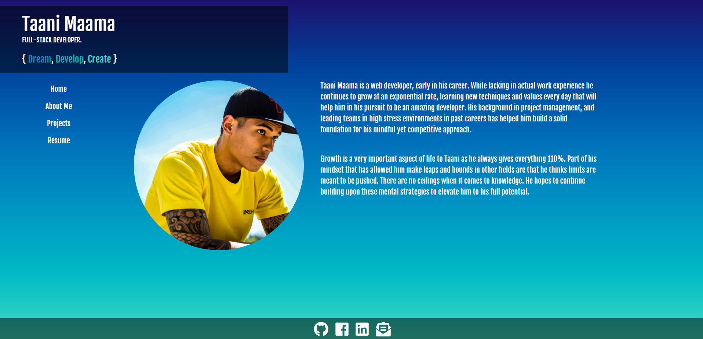

# Updated Portfolio

This is an updated portfolio with some of my actual work this time and a downloadable resume. I wanted to recreate the page with the newfound knowledge for APIs and JavaScript. From now on this HTML is where I will continue to update my journey as a full-stack developer.

Live URL: https://taanibravo.github.io/08-My-Portfolio/

## Directory
    1. ScreenShot
    2. User Story
    3. Criteria
    4. My Journey
    5. Resources

## ScreenShot


## User Story

```
AS A full-stack developer currently in the job market
I WANT to present people with a clean yet unique experience when viewing my portfolio
SO THAT I can land more jobs based on my work.
```

## Acceptance Criteria

```
Updated Portfolio
Updated GitHub Profile
Updated Resume
Updated LinkedIn Profile
```

## My Journey
This assignment felt like second nature to me as I already had an idea of what I wanted the page to look like. So going into the project, I really just started hammering away at this. I only came across issues when implementing the CSS transitions while also making the sections disappear based on buttons pressed. It took me a few attempts at the code but ultimately it came out great and the code is very simple to where it could be applied elsewhere.

## Resources
```
* https://getbootstrap.com/docs/4.1/
* https://api.jquery.com/
* https://stackoverflow.com/
```
